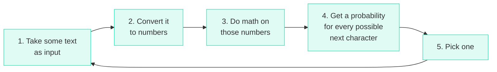
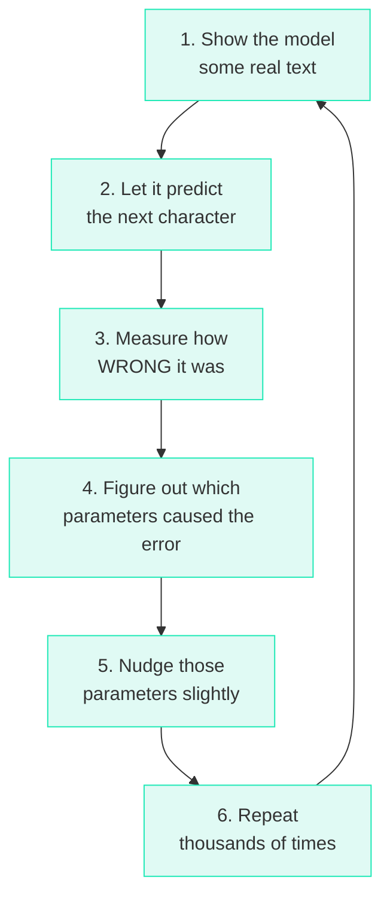

# What Is a Language Model?

## The Question That Started It All

Imagine you're playing a game. I show you a sentence with one word missing at the end:

> "The cat sat on the ___"

You'd probably guess **"mat"**, or maybe **"floor"**, or **"couch"**. You'd never guess **"quantum"** or **"photosynthesis"**. Why? Because you've read enough English to know what words *tend to follow* other words.

!!! tip "The Core Idea"

    **A language model is a program that plays this game.** Given some text, it predicts what comes next.

## But How?

Here's the thing — a computer doesn't "understand" English. It doesn't know what a cat is or what sitting means. All it can do is math on numbers.

So the entire challenge boils down to:

!!! question "The Fundamental Question"

    How do you turn "predicting the next word" into a **math problem** that a computer can solve?

The answer to this question is what the 200 lines of `microgpt.py` contain.

## The Core Loop

Every language model — from the simplest to ChatGPT — does exactly this:



But wait — how does the model know *which* math to do? The math involves multiplying inputs by **parameters** (thousands of numbers), and those parameters start out random.

That's where **training** comes in:



After enough repetitions, the parameters settle into values that make the model good at predicting.

## Character-Level vs. Word-Level

ChatGPT predicts **tokens** (roughly word-pieces). But `microgpt.py` predicts **individual characters** — one letter at a time.

!!! info "Why characters?"

    Because it's simpler. There are only ~27 characters (a-z plus a few special ones) versus tens of thousands of words. The core algorithm is identical; character-level just makes everything smaller and easier to understand.

In our case, the dataset is a list of human names:

```text title="Training Data (sample)"
emma
olivia
ava
isabella
sophia
...
```

The model will learn patterns like:

- Names often start with certain letters (e, a, s, m...)
- Certain letter pairs are common ("th", "an", "ar"...)
- Names tend to be 3-8 characters long
- Names end at some point (they don't go on forever)

## What You'll Build Mental Models For

By the end of this course, you'll understand:

| Concept | What it means in plain English |
|---------|-------------------------------|
| **Tokenization** | Converting letters to numbers |
| **Embeddings** | Giving each number a richer "meaning" |
| **Attention** | Letting the model look at all previous characters to decide the next one |
| **Parameters** | The thousands of numbers that encode what the model has "learned" |
| **Loss** | A single number measuring "how wrong was the prediction?" |
| **Gradient** | "Which direction should I nudge each parameter to reduce the loss?" |
| **Backpropagation** | Automatically computing all gradients at once |
| **Optimizer** | The strategy for nudging parameters (Adam is a clever one) |
| **Inference** | Using the trained model to generate new text |
