# The 200-Line Map

## The Entire File at a Glance

Before we dive into the details, let's look at the whole file from 30,000 feet. Every line of `microgpt.py` falls into one of **six blocks**:

```mermaid
block-beta
    columns 3
    block:header:3
        columns 3
        h["microgpt.py — 200 lines"]:3
    end
    l1["Lines 1-12"] s1["SETUP"] d1["Imports & random seed"]
    l2["Lines 14-27"] s2["DATA"] d2["Load dataset, build tokenizer"]
    l3["Lines 29-72"] s3["AUTOGRAD ENGINE"] d3["The Value class"]
    l4["Lines 74-90"] s4["PARAMETERS"] d4["Initialize model weights"]
    l5["Lines 92-144"] s5["ARCHITECTURE"] d5["The GPT model function"]
    l6["Lines 146-184"] s6["TRAINING"] d6["Optimizer + training loop"]
    l7["Lines 186-200"] s7["INFERENCE"] d7["Generate new text"]
```



Let's walk through each block.

---

## Block 1: Setup (Lines 1–12)

```python title="microgpt.py — Lines 1-12"
import os       # os.path.exists
import math     # math.log, math.exp
import random   # random.seed, random.choices, random.gauss, random.shuffle
random.seed(42) # Let there be order among chaos
```

Three standard Python libraries, zero external dependencies. The `random.seed(42)` ensures that every time you run the file, you get the same "random" numbers — making experiments reproducible.

---

## Block 2: Data & Tokenization (Lines 14–27)

```python title="microgpt.py — Lines 14-27 (simplified)"
# Download a dataset of names
docs = [...]           # list of names like ["emma", "olivia", ...]
uchars = sorted(set(...))  # unique characters: ['a', 'b', ..., 'z']
BOS = len(uchars)      # a special "start/end of name" token
vocab_size = len(uchars) + 1
```

!!! abstract "Problem → Solution"

    **Problem:** How do we turn text into numbers a computer can work with?

    **Solution:** Assign each unique character an ID (a=0, b=1, ...) plus one special token.

:material-folder-open: *Covered in detail in [Module 1](../01-data-and-tokenization/00-the-dataset.md)*

---

## Block 3: The Autograd Engine (Lines 29–72)

```python title="microgpt.py — Lines 29-72 (simplified)"
class Value:
    def __init__(self, data, children=(), local_grads=()):
        self.data = data
        self.grad = 0
        ...
    def backward(self):
        # Automatically compute gradients via the chain rule
        ...
```

!!! abstract "Problem → Solution"

    **Problem:** How do we figure out which parameters are responsible for errors?

    **Solution:** Wrap every number in a `Value` object that remembers how it was computed. Then walk backwards through the computation to assign blame.

This is the heart of the file. The `Value` class is a tiny **automatic differentiation engine** — the same idea behind PyTorch's `autograd`.

:material-folder-open: *Covered in detail in [Module 2](../02-calculus-and-autograd/00-why-we-need-derivatives.md)*

---

## Block 4: Parameters (Lines 74–90)

```python title="microgpt.py — Lines 74-90 (simplified)"
n_embd = 16       # embedding dimension
n_head = 4        # number of attention heads
n_layer = 1       # number of layers
block_size = 8    # maximum sequence length

state_dict = {
    'wte': matrix(...),    # token embeddings
    'wpe': matrix(...),    # position embeddings
    'lm_head': matrix(...), # output layer
    # + attention and MLP weights for each layer
}
```

!!! abstract "Problem → Solution"

    **Problem:** Where does the model store what it has learned?

    **Solution:** In matrices (grids of numbers) that start random and get tuned during training.

:material-folder-open: *Covered in detail in [Module 3, Lesson 0](../03-the-architecture/00-parameters-are-knowledge.md)*

---

## Block 5: The Architecture (Lines 92–144)

```python title="microgpt.py — Lines 92-144 (simplified)"
def gpt(token_id, pos_id, keys, values):
    # 1. Look up embeddings
    # 2. For each layer:
    #    a. Multi-head attention (look at context)
    #    b. MLP (process information)
    # 3. Output logits (raw scores for each possible next character)
    return logits
```

!!! abstract "Problem → Solution"

    **Problem:** Given the current character and position, how do we compute a prediction?

    **Solution:** A pipeline of transformations: embed → normalize → attend → think → predict.

This is the **Transformer architecture** — the "T" in "GPT".

:material-folder-open: *Covered in detail in [Module 3](../03-the-architecture/01-embeddings.md)*

---

## Block 6: Training (Lines 146–184)

```python title="microgpt.py — Lines 146-184 (simplified)"
for step in range(500):
    # 1. Pick a name from the dataset
    # 2. Forward: predict each next character
    # 3. Measure error (loss)
    # 4. Backward: compute gradients
    # 5. Update parameters with Adam optimizer
```

!!! abstract "Problem → Solution"

    **Problem:** How do we make the model better?

    **Solution:** Show it examples, measure its mistakes, and nudge its parameters in the right direction. Repeat 500 times.

:material-folder-open: *Covered in detail in [Module 4](../04-training/00-what-is-training.md)*

---

## Block 7: Inference (Lines 186–200)

```python title="microgpt.py — Lines 186-200 (simplified)"
for sample_idx in range(20):
    # Start with BOS token
    # Repeatedly: predict next character, pick one, add to output
    # Stop when BOS is predicted again (end of name)
    print(f"sample {sample_idx+1}: {''.join(sample)}")
```

!!! abstract "Problem → Solution"

    **Problem:** How do we use the trained model to create *new* names?

    **Solution:** Feed it the start signal, let it predict one character at a time, and collect the output.

:material-folder-open: *Covered in detail in [Module 5](../05-inference/00-generating-text.md)*

---

## The Dependency Chain

The blocks build on each other in a strict order:

```mermaid
flowchart TD
    A["📊 Data & Tokenizer"] --> B["⚙️ Autograd Engine"]
    B --> C["🔢 Parameters"]
    C --> D["🧠 Architecture"]
    D --> E["🏋️ Training"]
    E --> F["✨ Inference"]
```



You can't understand the architecture without understanding autograd.
You can't understand training without understanding the architecture.
And you can't generate text without a trained model.

!!! note "Course Order"

    This course follows this exact dependency chain. Every lesson builds on the previous one.
