# The Learning Machine Analogy

## A Machine That Learns From Mistakes

Before we touch any code, let's build an analogy that will carry us through the entire course.

### The Blindfolded Archer

Imagine a blindfolded archer trying to hit a target:

```mermaid
flowchart LR
    A["🏹 Archer\n(blindfolded)"] -- "shoots" --> B["❌ Miss!\n(too high, too right)"]
    B -- "friend says:\naim lower & left" --> C["🎯 Adjusts aim"]
    C -- "shoots again" --> A

    style A fill:#7c4dff,stroke:#5c3cbf,color:#fff
    style B fill:#e74c3c,stroke:#c0392b,color:#fff
    style C fill:#1de9b6,stroke:#0db99a,color:#000
```



1. The archer shoots an arrow (makes a **prediction**)
2. A friend tells them: "You were 2 meters too high and 1 meter to the right" (the **loss** — how wrong they were)
3. The friend also says: "Aim lower and more to the left" (the **gradient** — which direction to adjust)
4. The archer adjusts their aim slightly (the **parameter update**)
5. They shoot again

After hundreds of attempts, the archer is landing arrows near the bullseye — *without ever seeing the target*.

!!! tip "Key Insight"

    **This is exactly how neural networks learn.** They never "see" the answer directly — they just get told how wrong they were and which direction to adjust.

## Mapping the Analogy to Code

| Analogy | In `microgpt.py` | What it means |
|---------|-------------------|---------------|
| The archer's aim (angle, force) | **Parameters** (lines 74–90) | Thousands of numbers that control the model's behavior |
| Shooting an arrow | **Forward pass** (lines 163–168) | Running an input through the model to get a prediction |
| "You missed by X" | **Loss** (line 169) | A single number measuring how bad the prediction was |
| "Aim lower and left" | **Gradients** (line 172) | The direction to nudge each parameter |
| Adjusting aim | **Optimizer** (lines 174–182) | The rule for how much to nudge |
| Shooting again | **Next training step** (line 153) | Repeating with the next example |

## The Three Phases

The file does three things, in order:

=== "Phase 1: Build the Machine"

    **Lines 1–144** — Build the "archer": the model that takes an input and produces a prediction.

    At this point the parameters are random, so the predictions are garbage.

    ```text
    Input: "emm"  →  Model (random parameters)  →  Prediction: "q" ← wrong!
                                                     (should be "a")
    ```

=== "Phase 2: Train the Machine"

    **Lines 146–184** — Show the model thousands of real names. For each one:

    - Let it predict the next character
    - Tell it how wrong it was
    - Adjust parameters slightly

    ```text
    Step    1: loss = 3.8912  (predictions are random garbage)
    Step  100: loss = 2.4561  (starting to learn common patterns)
    Step  300: loss = 1.8234  (getting the hang of it)
    Step  500: loss = 1.5012  (reasonably good at predicting)
    ```

    The loss going **down** means the model is getting **better**.

=== "Phase 3: Use the Machine"

    **Lines 186–200** — Now that the parameters have been tuned, we can use the model to **generate new names** it has never seen:

    ```text
    sample  1: emma
    sample  2: ariel
    sample  3: kaya
    sample  4: suri
    sample  5: livia
    ```

    These names didn't exist in the training data — the model *invented* them by learning the patterns of what makes a name "name-like."

## Why "Everything Else Is Just Efficiency"

!!! quote "Karpathy's claim"

    *"This is the complete algorithm. Everything else is just efficiency."*

What does he mean? This 200-line file contains:

| What | Present in microgpt.py? | What the "real world" adds |
|------|:-----------------------:|---------------------------|
| Tokenization | :white_check_mark: | Faster tokenizers (BPE) with larger vocabularies |
| Autograd | :white_check_mark: | GPU-accelerated autograd (PyTorch/JAX) |
| Transformer architecture | :white_check_mark: | More layers, bigger embeddings, but same structure |
| Attention mechanism | :white_check_mark: | FlashAttention (same math, faster execution) |
| Training loop | :white_check_mark: | Distributed training across thousands of GPUs |
| Adam optimizer | :white_check_mark: | Same optimizer, just parallelized |
| Text generation | :white_check_mark: | Same algorithm with beam search, nucleus sampling |

The **algorithm** is identical. What changes at scale is:

- **Speed:** GPUs instead of Python loops
- **Size:** Billions of parameters instead of thousands
- **Data:** Terabytes of text instead of a names file

But the *logic* — embed, attend, predict, measure error, compute gradients, update — is the same logic you'll learn in this course.

## The Road Ahead

```mermaid
flowchart TD
    HERE["📍 You are here"] --> M1
    M1["Module 1: How do we get data\nand turn it into numbers?"] --> M2
    M2["Module 2: How do we automatically\nfind 'which way to nudge'?"] --> M3
    M3["Module 3: What math does the model\nactually do on the numbers?"] --> M4
    M4["Module 4: How does the\ntraining loop work?"] --> M5
    M5["Module 5: How do we\ngenerate new text?"] --> DONE
    DONE["✅ You understand the entire file"]

    style HERE fill:#e74c3c,stroke:#c0392b,color:#fff
    style M1 fill:#7c4dff,stroke:#5c3cbf,color:#fff
    style M2 fill:#6a3de8,stroke:#4a2db8,color:#fff
    style M3 fill:#5830d1,stroke:#3820a1,color:#fff
    style M4 fill:#4623ba,stroke:#26138a,color:#fff
    style M5 fill:#341099,stroke:#240a69,color:#fff
    style DONE fill:#1de9b6,stroke:#0db99a,color:#000
```


