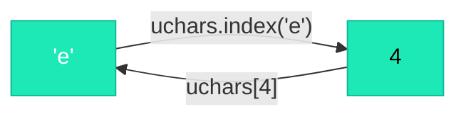

# Characters as Numbers

## The Problem

We have a list of names like `["emma", "olivia", ...]`. But computers can only do math on **numbers**. We need a way to convert characters to numbers and back.

This conversion process is called **tokenization**.

## What Is a Token?

!!! info "Definition"

    A **token** is the smallest unit the model works with. In our case, each token is a single character. In larger models (like ChatGPT), tokens are parts of words (like "un", "believ", "able").

Using characters keeps things simple: there are only ~27 unique characters in our names dataset.

## The Code (Lines 23–27)

```python title="microgpt.py — Lines 23-27"
uchars = sorted(set(''.join(docs)))  # unique characters in the dataset
BOS = len(uchars)                     # token id for Beginning of Sequence
vocab_size = len(uchars) + 1          # total unique tokens (+1 for BOS)
print(f"vocab size: {vocab_size}")
```

### Line 24: Building the vocabulary

```python title="microgpt.py — Line 24"
uchars = sorted(set(''.join(docs)))
```

Let's trace this step by step:

=== "Step 1: Join"

    ```python
    ''.join(docs)  # → "emmaoliviaava..." (all names glued together)
    ```

=== "Step 2: Unique"

    ```python
    set(...)  # → {'e', 'm', 'a', 'o', 'l', 'i', 'v', ...}  (unique chars only)
    ```

=== "Step 3: Sort"

    ```python
    sorted(...)  # → ['a', 'b', 'c', 'd', ..., 'z']  (sorted alphabetically)
    ```

The result is a sorted list of every unique character:

```python
uchars = ['a', 'b', 'c', 'd', 'e', ..., 'y', 'z']
# index:   0    1    2    3    4   ...   24   25
```

The **index** of each character in this list becomes its **token ID**:

- `'a'` → 0
- `'b'` → 1
- `'e'` → 4
- `'z'` → 25

## Encoding and Decoding



The name "emma" becomes:

| Character | Token ID |
|:---------:|:--------:|
| `'e'` | 4 |
| `'m'` | 12 |
| `'m'` | 12 |
| `'a'` | 0 |

$$\text{"emma"} \rightarrow [4, 12, 12, 0]$$

And $[4, 12, 12, 0]$ can be decoded back to `"emma"`.

## Why Sorted?

Sorting (`sorted(...)`) isn't strictly necessary — any consistent mapping would work. But sorting makes the mapping **deterministic and predictable**, which helps with debugging.

## Why Not Just Use ASCII?

!!! question "Good question"

    Characters already have numbers assigned to them (ASCII codes: a=97, b=98, ...). Why not use those?

    1. **Wasted space:** ASCII has 128 codes, but we only use ~27 characters. Our model would have to learn about 100+ unused tokens, wasting parameters.
    2. **Contiguous IDs:** We want IDs from 0 to $N-1$ with no gaps, so they can directly index into arrays and matrices.

??? note "Terminology"

    | Term | Meaning |
    |------|---------|
    | **Token** | The smallest unit the model processes (here: a character) |
    | **Tokenizer** | The system that converts between text and token IDs |
    | **Vocabulary** | The complete set of all possible tokens |
    | **vocab_size** | How many unique tokens exist (here: 27 = 26 letters + BOS) |
    | **Encoding** | Converting text → token IDs |
    | **Decoding** | Converting token IDs → text |
