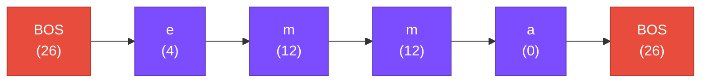

# The BOS Token

## The Problem

Suppose the model is learning from the name "emma". We train it on these predictions:

| Given | Predict |
|:-----:|:-------:|
| `'e'` | `'m'` |
| `'m'` | `'m'` |
| `'m'` | `'a'` |

But two critical things are missing:

!!! warning "Two missing pieces"

    1. **How does the model know to start with 'e'?** Something has to come *before* the first character.
    2. **How does the model know to stop after 'a'?** It could keep generating characters forever.

We need a way to say: **"This is the beginning"** and **"This is the end."**

## The Solution: BOS (Beginning of Sequence)

`microgpt.py` uses a single special token called **BOS** for both purposes:

```python title="microgpt.py — Lines 25-26"
BOS = len(uchars)      # token id 26 (one past the last character)
vocab_size = len(uchars) + 1  # 27 total tokens
```

`BOS` gets the token ID `26` — the next available number after 'z' (which is 25).

## How BOS Works

When preparing a name for training, the code wraps it with BOS on both sides:

```python title="microgpt.py — Line 157"
tokens = [BOS] + [uchars.index(ch) for ch in doc] + [BOS]
```

For the name "emma":



Now the training pairs become:

| Input | → | Target | Meaning |
|:-----:|:-:|:------:|---------|
| BOS | → | `'e'` | "After the start signal, predict 'e'" |
| `'e'` | → | `'m'` | "After 'e', predict 'm'" |
| `'m'` | → | `'m'` | "After 'm', predict 'm'" |
| `'m'` | → | `'a'` | "After 'm', predict 'a'" |
| `'a'` | → | BOS | "After 'a', predict the STOP signal" |

This solves both problems:

- **Starting:** The model learns what characters are likely *after BOS* (i.e., which characters names typically start with)
- **Stopping:** The model learns *when to produce BOS* (i.e., when the name should end)

## Why One Token for Both?

!!! tip "Elegant design"

    Using the same token for start and stop is elegant:

    - It means fewer special tokens (smaller vocabulary)
    - During generation, we feed BOS to start, and stop when the model produces BOS
    - Mathematically, it doesn't matter — the model learns from context whether BOS means "start" or "stop"

## The Complete Token System

| Token ID | Character | Type |
|:--------:|:---------:|:----:|
| 0 | `'a'` | regular |
| 1 | `'b'` | regular |
| ... | ... | regular |
| 25 | `'z'` | regular |
| 26 | `<BOS>` | ==special== |
| | **vocab_size = 27** | |

## Checkpoint ✓

!!! success "What we know so far"

    - :white_check_mark: How to load a dataset of names
    - :white_check_mark: How to convert characters to numbers (tokenization)
    - :white_check_mark: How to mark the start and end of each name (BOS token)

What we **don't** know yet: how does the model actually *use* these numbers to make predictions? For that, we need some math — specifically, we need a way to figure out "which direction to nudge" after making a wrong prediction.

??? note "Terminology"

    | Term | Meaning |
    |------|---------|
    | **BOS** | Beginning of Sequence — a special token marking the start (and end) of a document |
    | **Special token** | A token that doesn't represent a real character; it's a control signal |
    | **Sequence** | An ordered list of tokens |
    | **Wrapping** | Adding special tokens around a document before training |
