# Why We Need Derivatives

## The Problem

We have a model that takes a character and produces a prediction for the next character. But right now all its parameters are **random**, so its predictions are garbage.

How do we improve it?

### The Naive Approach: Random Search

One idea: randomly change each parameter, check if the loss went down, and keep the change if it did.

```text
Parameter p = 0.5
Loss = 3.2

Try p = 0.51  → Loss = 3.1 ✓  (keep it!)
Try p = 0.52  → Loss = 3.3 ✗  (revert!)
Try p = 0.49  → Loss = 3.0 ✓  (keep it!)
...
```

This works! But it's hopelessly slow. If you have 10,000 parameters, and you try 10 variations each, that's **100,000 forward passes per step**. At 500 training steps, that's 50 million forward passes. We'd be here forever.

### The Key Insight

!!! tip "The Big Idea"

    What if, instead of guessing, we could **calculate** which direction to nudge each parameter — all at once, in a single pass?

    That's exactly what **derivatives** give us.

## What Is a Derivative?

A derivative answers one question:

> If I change this input by a tiny amount, how much does the output change?

### Example: A Simple Function

$$f(x) = x^2$$

| $x$ | $f(x) = x^2$ |
|:---:|:-------------:|
| 1 | 1 |
| 2 | 4 |
| 3 | 9 |
| 4 | 16 |

What happens when we nudge $x$ from 3 to 3.001?

$$f(3) = 9$$

$$f(3.001) = 9.006001$$

The output changed by ~0.006 when we changed the input by 0.001. The **rate of change** is:

$$\frac{\Delta f}{\Delta x} = \frac{0.006001}{0.001} = 6.001 \approx 6$$

This rate of change is the derivative. For $f(x) = x^2$, the derivative is $f'(x) = 2x$. At $x = 3$, that's $2 \times 3 = 6$. :white_check_mark:

## The Derivative as a Direction Sign

The derivative tells you **two things**:

=== "Direction (sign)"

    - **Positive derivative** → increasing $x$ increases the output
    - **Negative derivative** → increasing $x$ decreases the output

=== "Sensitivity (magnitude)"

    - **Large absolute value** → this parameter matters a lot
    - **Small absolute value** → this parameter barely matters

## Why This Matters for Training

In training, we want to **minimize the loss** (the error). If we know the derivative of the loss with respect to each parameter:

!!! example "The Update Rule"

    $$\text{derivative is positive} \implies \text{parameter is pushing loss UP} \implies \text{DECREASE it}$$

    $$\text{derivative is negative} \implies \text{parameter is pushing loss DOWN} \implies \text{INCREASE it}$$

    The update rule is beautifully simple:

    $$\text{parameter} = \text{parameter} - \text{learning\_rate} \times \text{derivative}$$

    The minus sign flips the direction — we always move **opposite** to the derivative, because we want to go **downhill** on the loss.

## The Hill Analogy

Imagine you're on a hilly landscape in fog (you can't see the valley). The loss is your altitude. The derivative tells you the slope under your feet.

```mermaid
flowchart LR
    A["🏔️ High Loss\n(positive slope)"] -- "step opposite\nto slope" --> B["📍 You are here"]
    B -- "step opposite\nto slope" --> C["🏞️ Low Loss\n(the valley)"]

    style A fill:#e74c3c,stroke:#c0392b,color:#fff
    style B fill:#e67e22,stroke:#d35400,color:#fff
    style C fill:#1de9b6,stroke:#0db99a,color:#000
```



- Positive slope → you're going uphill → step in the negative direction
- Negative slope → you're going downhill → keep going

Each small step takes you closer to the valley.

## Derivatives We Need to Know

For `microgpt.py`, we only need the derivatives of a few basic operations:

| Operation | Formula | Derivative w.r.t. $x$ |
|-----------|:-------:|:-----:|
| Addition | $x + y$ | $1$ |
| Multiplication | $x \times y$ | $y$ |
| Power | $x^n$ | $n \cdot x^{n-1}$ |
| Exponential | $e^x$ | $e^x$ |
| Logarithm | $\ln(x)$ | $\frac{1}{x}$ |
| ReLU | $\max(0, x)$ | $1$ if $x > 0$, else $0$ |

!!! note

    Don't memorize these. They'll come up naturally when we look at the `Value` class, and we'll explain each one in context.

## But There's a Catch

Real models aren't just $f(x) = x^2$. They're compositions of hundreds of operations:

```python
loss = log(softmax(linear(relu(linear(embed(token))))))
```

How do we find the derivative of the loss with respect to a parameter buried deep inside `embed()`?

That's where the **chain rule** comes in.
