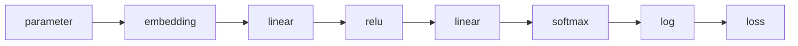
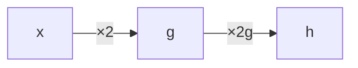

# The Chain Rule

## The Problem

We know derivatives tell us "which way to nudge." But in a neural network, the loss depends on parameters through a **long chain** of operations:



How do we find the derivative of `loss` with respect to `parameter` when there are 6 operations between them?

## Composition of Functions

When you nest functions inside functions, it's called **composition**:

$$\text{Simple: } f(x) = x^2 \quad \text{(one step)}$$

$$\text{Composed: } h(x) = f(g(x)) \quad \text{where } g(x) = 2x + 1 \text{ and } f(z) = z^2$$

$$\text{So } h(x) = (2x + 1)^2 \quad \text{(two steps)}$$

For $h(x) = (2x + 1)^2$:

1. First compute $g = 2x + 1$
2. Then compute $f = g^2$

The question is: what is the derivative of $h$ with respect to $x$?

## The Chain Rule

!!! tip "The Chain Rule"

    **The derivative of a composition is the product of the individual derivatives.**

    $$\frac{dh}{dx} = \frac{df}{dg} \times \frac{dg}{dx}$$

Let's verify with numbers. For $h(x) = (2x + 1)^2$ at $x = 3$:

=== "Step 1: Individual derivatives"

    $$g(x) = 2x + 1 \implies \frac{dg}{dx} = 2$$

    $$f(g) = g^2 \implies \frac{df}{dg} = 2g = 2(2x + 1)$$

=== "Step 2: Chain rule"

    $$\frac{dh}{dx} = \frac{df}{dg} \times \frac{dg}{dx} = 2(2 \times 3 + 1) \times 2 = 2(7) \times 2 = 28$$

=== "Step 3: Verify"

    Nudge $x$ from 3 to 3.001:

    $$h(3) = (2 \times 3 + 1)^2 = 7^2 = 49$$

    $$h(3.001) = (2 \times 3.001 + 1)^2 = 7.002^2 = 49.028004$$

    $$\frac{\Delta h}{\Delta x} = \frac{0.028004}{0.001} = 28.004 \approx 28 \checkmark$$

## The Chain Rule Visually

Think of it like a pipeline. Each stage multiplies the "sensitivity":



If $x$ wiggles by 1:

- $g$ wiggles by 2 (because $\frac{dg}{dx} = 2$)
- $h$ wiggles by $2 \times 2g$ (because $\frac{df}{dg} = 2g$, and $g$ already wiggled by 2)

## Longer Chains

The chain rule extends to any number of steps:

$$f(g(h(x))) \implies \frac{df}{dx} = \frac{df}{dg} \times \frac{dg}{dh} \times \frac{dh}{dx}$$

Just multiply all the individual derivatives along the chain.

!!! info

    In a neural network, this chain might be 10 or 100 steps long. But the principle is always the same: **multiply the local derivatives along the path**.

## The Key Insight for Autograd

This is why `microgpt.py`'s `Value` class stores **local gradients** at each operation:

| Operation | Local gradient of $z$ w.r.t. $x$ |
|:---------:|:-----:|
| $z = x + y$ | $1$ |
| $z = x \times y$ | $y$ |
| $z = x^2$ | $2x$ |

Each operation only needs to know its *own* local derivative. The chain rule takes care of composing them into the full derivative.

## A Three-Node Example

Let's trace through a tiny computation graph:

```python
a = 2.0
b = 3.0
c = a × b    # c = 6.0
d = c + 1    # d = 7.0
loss = d²    # loss = 49.0
```

We want: $\frac{d(\text{loss})}{da}$ — how does the loss change if we tweak $a$?

$$\frac{d(\text{loss})}{da} = \frac{d(\text{loss})}{dd} \times \frac{dd}{dc} \times \frac{dc}{da} = 2d \times 1 \times b = 2(7) \times 1 \times 3 = 42$$

Each factor is a **local gradient** — the derivative of one node with respect to its immediate input. The chain rule multiplies them together.

??? note "Terminology"

    | Term | Meaning |
    |------|---------|
    | **Chain rule** | $\frac{d(f \circ g)}{dx} = \frac{df}{dg} \times \frac{dg}{dx}$ — multiply local derivatives |
    | **Local gradient** | The derivative of one operation w.r.t. its immediate input |
    | **Composition** | Nesting functions: $f(g(x))$ |
    | **Sensitivity** | How much the output changes when an input wiggles |
