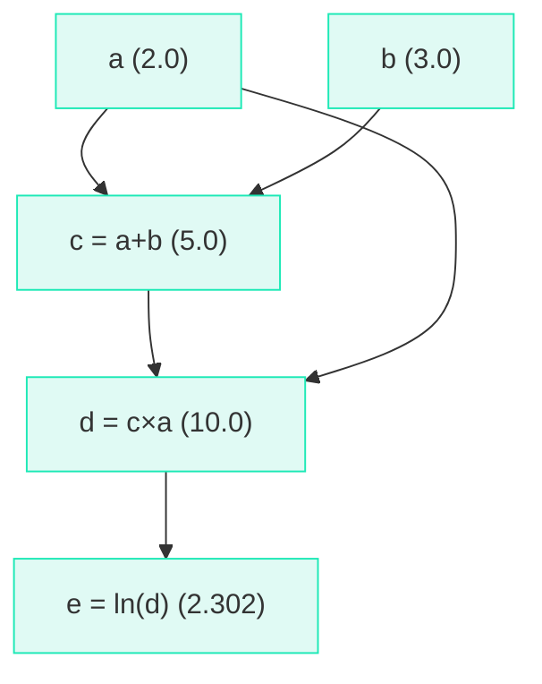

# The Value Class

## The Problem

We know the chain rule lets us compute derivatives through a chain of operations. But doing this by hand for thousands of parameters and hundreds of operations is impossible.

We need the computer to do it **automatically**. That's called **automatic differentiation** (autograd for short).

!!! tip "The Trick"

    Every time we do a math operation, we **record** what we did and how to differentiate it. Then at the end, we replay the recording backwards to compute all derivatives at once.

## The Value Class (Lines 30–37)

Here is the core data structure:

```python title="microgpt.py — Lines 30-37"
class Value:
    """Stores a single scalar value and its gradient, as a node in a computation graph."""

    def __init__(self, data, children=(), local_grads=()):
        self.data = data                # scalar value of this node
        self.grad = 0                   # derivative of the loss w.r.t. this node
        self._children = children       # children of this node in the computation graph
        self._local_grads = local_grads # local derivative of this node w.r.t. its children
```

Every number in the model is wrapped in a `Value` object. Each `Value` stores four things:

| Attribute | What it stores | Example |
|-----------|---------------|---------|
| `data` | The actual number | 3.14 |
| `grad` | How much the loss changes if this number changes | Filled in during backward pass |
| `_children` | Which `Value`s were combined to produce this one | `(a, b)` if this value = a + b |
| `_local_grads` | The derivative of this operation w.r.t. each child | `(1, 1)` for addition |

## Addition (Lines 39–41)

```python title="microgpt.py — Lines 39-41"
def __add__(self, other):
    other = other if isinstance(other, Value) else Value(other)
    return Value(self.data + other.data, (self, other), (1, 1))
```

When you write `c = a + b` where `a` and `b` are `Value` objects:

1. `self.data + other.data` → compute the result (forward pass)
2. `(self, other)` → remember the children (a and b)
3. `(1, 1)` → store the local gradients

Why `(1, 1)` for addition? Because:

$$c = a + b \implies \frac{dc}{da} = 1, \quad \frac{dc}{db} = 1$$

Changing $a$ by 1 changes $c$ by 1. Same for $b$.

!!! example "Example"

    ```python
    a = Value(2.0)
    b = Value(3.0)
    c = a + b  # c.data = 5.0, c._children = (a, b), c._local_grads = (1, 1)
    ```

    ```mermaid
    flowchart BT
        A["a (2.0)"] -- "grad = 1" --> C["c (5.0)"]
        B["b (3.0)"] -- "grad = 1" --> C

        style C fill:#e0faf4,stroke:#1de9b6
        style A fill:#e0faf4,stroke:#1de9b6
        style B fill:#e0faf4,stroke:#1de9b6
    ```

## Multiplication (Lines 43–45)

```python title="microgpt.py — Lines 43-45"
def __mul__(self, other):
    other = other if isinstance(other, Value) else Value(other)
    return Value(self.data * other.data, (self, other), (other.data, self.data))
```

For $c = a \times b$:

$$\frac{dc}{da} = b, \quad \frac{dc}{db} = a$$

So the local gradients are `(other.data, self.data)` — each child's gradient is the *other* child's value.

!!! example "Example — Notice the swap!"

    ```python
    a = Value(2.0)
    b = Value(3.0)
    c = a * b  # c.data = 6.0, c._local_grads = (3.0, 2.0)
    ```

    ```mermaid
    flowchart BT
        A["a (2.0)"] -- "grad = 3.0 ← b's value!" --> C["c (6.0)"]
        B["b (3.0)"] -- "grad = 2.0 ← a's value!" --> C

        style C fill:#e0faf4,stroke:#1de9b6
        style A fill:#e0faf4,stroke:#1de9b6
        style B fill:#e0faf4,stroke:#1de9b6
    ```

    **Why swapped?** If you're multiplying $2 \times 3$ and increase the 2 to 3, you get $3 \times 3 = 9$. The result changed by 3 (which is the *other* number).

## Power (Line 47)

```python title="microgpt.py — Line 47"
def __pow__(self, other):
    return Value(self.data**other, (self,), (other * self.data**(other-1),))
```

$$c = a^n \implies \frac{dc}{da} = n \cdot a^{n-1}$$

This is the **power rule** from calculus. Note that `other` here is a plain number, not a `Value`.

!!! example "Example: $a^2$ at $a = 3$"

    $$\frac{dc}{da} = 2 \times 3^{(2-1)} = 2 \times 3 = 6$$

## Logarithm (Line 48)

```python title="microgpt.py — Line 48"
def log(self):
    return Value(math.log(self.data), (self,), (1/self.data,))
```

$$c = \ln(a) \implies \frac{dc}{da} = \frac{1}{a}$$

This is used in the loss function: $-\log(\text{probability})$. If the probability is 0.5, the gradient is $\frac{1}{0.5} = 2$.

## Exponential (Line 49)

```python title="microgpt.py — Line 49"
def exp(self):
    return Value(math.exp(self.data), (self,), (math.exp(self.data),))
```

$$c = e^a \implies \frac{dc}{da} = e^a$$

!!! info "Beautiful fact"

    The exponential function is its own derivative — one of the most elegant facts in math. This is used in the softmax function.

## ReLU (Line 50)

```python title="microgpt.py — Line 50"
def relu(self):
    return Value(max(0, self.data), (self,), (float(self.data > 0),))
```

ReLU (Rectified Linear Unit) is the simplest "activation function":

$$\text{relu}(x) = \max(0, x) = \begin{cases} x & \text{if } x > 0 \\ 0 & \text{otherwise} \end{cases}$$

Its derivative:

$$\frac{d(\text{relu})}{dx} = \begin{cases} 1 & \text{if } x > 0 \\ 0 & \text{otherwise} \end{cases}$$

If the input is positive, the gradient flows through unchanged. If negative, the gradient is zero — the operation is "dead."

## Convenience Operations (Lines 51–57)

```python title="microgpt.py — Lines 51-57"
def __neg__(self): return self * -1
def __radd__(self, other): return self + other
def __sub__(self, other): return self + (-other)
def __rsub__(self, other): return other + (-self)
def __rmul__(self, other): return self * other
def __truediv__(self, other): return self * other**-1
def __rtruediv__(self, other): return other * self**-1
```

These define subtraction, division, and negation in terms of the primitives we already have:

| Operation | Implemented as |
|:---------:|:--------------:|
| $-a$ | `a * -1` |
| $a - b$ | `a + (-b)` |
| $a / b$ | `a * b^{-1}` |

!!! note

    No new gradient logic needed! They just reuse `__add__`, `__mul__`, and `__pow__`.

    The `__radd__` and `__rmul__` variants handle cases like `3 + value` (when the `Value` is on the right side of the operator).

## The Computation Graph So Far

Every operation creates a new `Value` node, linked to its children:

```python
a = Value(2.0)
b = Value(3.0)
c = a + b        # 5.0
d = c * a        # 10.0
e = d.log()      # 2.302...
```



The graph records the entire computation. Now we need to walk it backwards to compute gradients.

??? note "Terminology"

    | Term | Meaning |
    |------|---------|
    | **Value** | A wrapper around a number that tracks how it was computed |
    | **Computation graph** | The tree of `Value` nodes showing all operations |
    | **Local gradient** | The derivative of one operation w.r.t. its inputs |
    | **Autograd** | Automatic differentiation — computing all gradients automatically |
    | **ReLU** | $\max(0, x)$ — an activation function that zeros out negatives |
