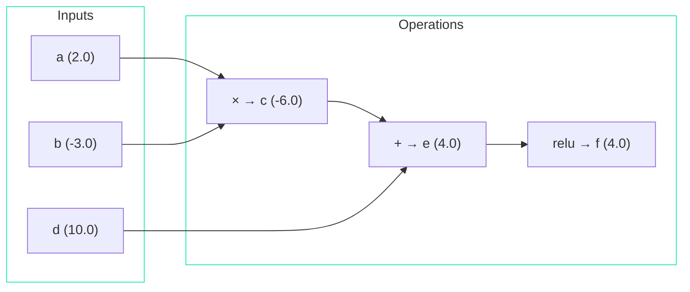

# The Forward Pass

## What Is a "Forward Pass"?

The forward pass is simply **computing the output given an input**. You feed in numbers on one end, and math operations transform them step by step until you get a result.

It's called "forward" because data flows in one direction: from inputs → through operations → to output.

## A Concrete Example

Let's trace a tiny computation:

```python
a = Value(2.0)
b = Value(-3.0)
c = a * b        # -6.0
d = Value(10.0)
e = c + d        # 4.0
f = e.relu()     # 4.0 (positive, so unchanged)
```

=== "Step-by-step"

    | Step | Computation | Result |
    |:----:|------------|:------:|
    | 1 | `a.data = 2.0` | given |
    | 2 | `b.data = -3.0` | given |
    | 3 | `c.data = 2.0 × (-3.0)` | -6.0 |
    | 4 | `d.data = 10.0` | given |
    | 5 | `e.data = -6.0 + 10.0` | 4.0 |
    | 6 | `f.data = max(0, 4.0)` | 4.0 |

=== "As a graph"

    ```mermaid
    flowchart LR
        A["a (2.0)"] --> MUL["× → c (-6.0)"]
        B["b (-3.0)"] --> MUL
        MUL --> ADD["+ → e (4.0)"]
        D["d (10.0)"] --> ADD
        ADD --> RELU["relu → f (4.0)"]

        style A fill:#1de9b6,stroke:#0db99a,color:#fff
        style B fill:#1de9b6,stroke:#0db99a,color:#fff
        style D fill:#1de9b6,stroke:#0db99a,color:#fff
        style MUL fill:#12a889,stroke:#0a7d68,color:#fff
        style ADD fill:#0d8872,stroke:#085c4e,color:#fff
        style RELU fill:#1de9b6,stroke:#0db99a,color:#000
    ```

Each arrow is a `Value` node. Each operation creates a new node.

## What Gets Recorded

During the forward pass, each new `Value` stores:

1. The computed result (`.data`)
2. References to the inputs (`._children`)
3. The local derivatives (`._local_grads`)

!!! example "For node `c = a * b`"

    ```python
    c.data = -6.0
    c._children = (a, b)
    c._local_grads = (-3.0, 2.0)   # (b.data, a.data)
    ```

!!! example "For node `e = c + d`"

    ```python
    e.data = 4.0
    e._children = (c, d)
    e._local_grads = (1, 1)
    ```

This recording is **building the computation graph** as a side effect of the forward pass. We'll need this graph for the backward pass.

## The Forward Pass in microgpt.py

In the actual model, the forward pass happens when we call the `gpt()` function:

```python title="microgpt.py — Line 165"
logits = gpt(token_id, pos_id, keys, values)
```

This call triggers a cascade of hundreds of operations:

1. Look up embeddings (addition of two `Value` rows)
2. Normalize (multiply, divide, power operations on `Value` nodes)
3. Attention (matrix multiplications, softmax — all on `Value` nodes)
4. MLP (more linear transforms and activation)
5. Output logits (one final linear transform)

!!! important

    Every single arithmetic operation creates a new `Value` node, and by the time `logits` is returned, there's a massive computation graph in memory, with every node remembering exactly how it was produced.

## Why Build This Graph?

Because the **backward pass** will walk this graph in reverse to compute gradients. Without the graph, we wouldn't know which operations happened, in what order, with what inputs. The graph is the "recording" that makes automatic differentiation possible.

## The Full Picture



**FORWARD** = left to right (compute values) ➡️

**BACKWARD** = right to left (compute gradients) ⬅️

??? note "Terminology"

    | Term | Meaning |
    |------|---------|
    | **Forward pass** | Computing the output from the input, step by step |
    | **Computation graph** | The tree of `Value` nodes built during the forward pass |
    | **Leaf node** | An input `Value` with no children (parameters, inputs) |
    | **Internal node** | A `Value` created by an operation on other `Value`s |
    | **Root node** | The final output (usually the loss) |
