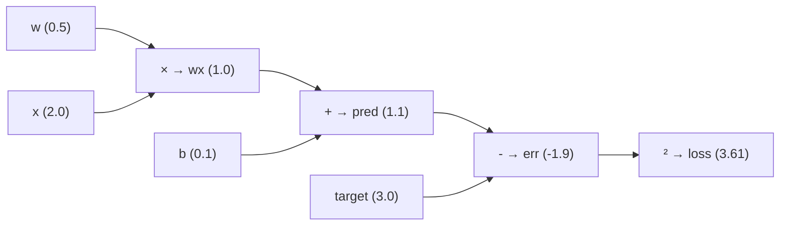

# Building a Computation Graph

## Putting It All Together

We've seen the individual pieces:

- `Value` wraps numbers and records operations
- The forward pass builds the graph
- The backward pass walks it in reverse to compute gradients

Now let's see how a **realistic example** looks — one that mirrors what actually happens inside `microgpt.py`.

## A Mini Neural Network

Let's build the simplest possible "network" — one that takes a number and tries to predict another number:

```python
# Two parameters (the model's "knowledge")
w = Value(0.5)    # weight
b = Value(0.1)    # bias

# Input and target
x = 2.0           # input (plain number, not a Value)
target = 3.0      # we want the model to output 3.0

# Forward pass: the prediction
prediction = w * x + b    # 0.5 × 2.0 + 0.1 = 1.1

# Loss: how wrong are we?
error = prediction - target    # 1.1 - 3.0 = -1.9
loss = error ** 2              # (-1.9)² = 3.61
```

### The graph that gets built:



### Now backward:

```python
loss.backward()
```

=== "Gradient computation"

    | Node | Gradient | Computation |
    |------|:--------:|-------------|
    | `loss` | $1.0$ | seed |
    | `err` | $-3.8$ | $2 \times (-1.9) \times 1.0$ (power rule) |
    | `pred` | $-3.8$ | $1 \times \text{err.grad}$ |
    | `b` | $-3.8$ | $1 \times \text{pred.grad}$ (addition) |
    | `wx` | $-3.8$ | $1 \times \text{pred.grad}$ (addition) |
    | `w` | $-7.6$ | $x \times \text{wx.grad} = 2.0 \times (-3.8)$ |

=== "What the gradients mean"

    $$w\text{.grad} = -7.6 \implies \text{increasing } w \text{ would DECREASE the loss}$$

    $$b\text{.grad} = -3.8 \implies \text{increasing } b \text{ would DECREASE the loss}$$

    This makes sense! Our prediction was 1.1 but the target was 3.0 — we're too low. Both $w$ and $b$ need to increase.

=== "Update parameters"

    ```python
    learning_rate = 0.01
    w.data -= learning_rate * w.grad   # 0.5 - 0.01×(-7.6) = 0.576
    b.data -= learning_rate * b.grad   # 0.1 - 0.01×(-3.8) = 0.138
    ```

    New prediction: $0.576 \times 2.0 + 0.138 = 1.29$ (closer to 3.0!)

    Repeat this hundreds of times, and $w$ and $b$ will converge to values that make the prediction close to 3.0.

## Scale: What the Real Graph Looks Like

In the mini example above, the graph had ~8 nodes. In `microgpt.py`, a single forward pass through the `gpt()` function creates **thousands** of nodes:

| Component | Approximate # of Value operations |
|-----------|:---------------------------------:|
| Embedding lookup | ~16 |
| RMSNorm | ~50 |
| One attention head | ~200 |
| Four attention heads | ~800 |
| MLP (expand + activate + compress) | ~1,500 |
| Output linear | ~400 |
| Softmax | ~80 |
| Loss (log) | ~2 |
| **Total per token** | **~3,000+** |
| **Per 8-token sequence** | **~24,000+** |

!!! important "The Power of Autograd"

    All of these nodes are `Value` objects sitting in memory, linked together. When you call `loss.backward()`, the algorithm visits each node exactly once (thanks to topological sort) and computes the gradient. **One pass, all gradients, every parameter.**

    - **Without autograd:** ~20,000 forward passes to estimate gradients for 10,000 parameters
    - **With autograd:** Exactly **2 passes** — one forward, one backward

## Checkpoint ✓

!!! success "What you understand now"

    - :white_check_mark: Derivatives: "which direction to nudge" (Lesson 0)
    - :white_check_mark: Chain rule: composing derivatives through a chain (Lesson 1)
    - :white_check_mark: Value class: recording operations and storing local gradients (Lesson 2)
    - :white_check_mark: Forward pass: computing the output and building the graph (Lesson 3)
    - :white_check_mark: Backward pass: walking the graph in reverse to compute all gradients (Lesson 4)
    - :white_check_mark: The full picture: how these pieces work together (this lesson)

What we **don't** know yet: what does the `gpt()` function actually compute? What is attention? What is a linear layer? For that, we need to understand the **architecture**.
