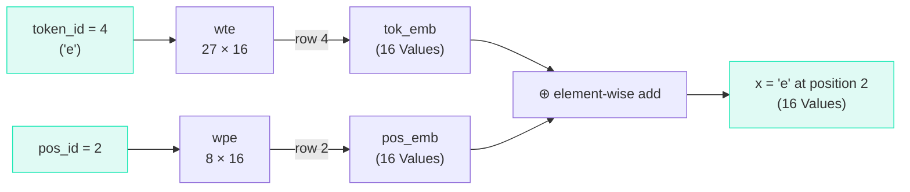

# Embeddings

## The Problem

We have token IDs: `'e'` = 4, `'m'` = 12, etc. But a single number doesn't carry much information. The model needs a richer representation.

Consider: is `'e'` (4) more similar to `'d'` (3) than to `'z'` (25)? No — the numeric ordering is arbitrary. But with a single number, the model has no way to tell.

## The Solution: Embedding Vectors

Instead of representing each token as a single number, we represent it as a **list of numbers** (a vector). Each token gets its own 16-dimensional vector:

```text
'a' (token 0)  → [0.01, -0.03, 0.02, ..., 0.04]   (16 numbers)
'b' (token 1)  → [-0.02, 0.01, -0.01, ..., 0.03]   (16 numbers)
'e' (token 4)  → [0.03, 0.02, -0.04, ..., -0.01]   (16 numbers)
```

These 16 numbers capture a token's "meaning" in a way the model can work with. After training, tokens with similar roles will have similar vectors.

## The Code (Lines 109–111)

```python title="microgpt.py — Lines 109-111 (inside gpt())"
tok_emb = state_dict['wte'][token_id]  # token embedding
pos_emb = state_dict['wpe'][pos_id]    # position embedding
x = [t + p for t, p in zip(tok_emb, pos_emb)]  # combined embedding
```

=== "Line 109: Token Embedding"

    ```python
    tok_emb = state_dict['wte'][token_id]
    ```

    `state_dict['wte']` is a 27×16 matrix — the **token embedding table**. For `token_id = 4` (the letter `'e'`), we grab row 4 — a list of 16 `Value` objects.

    This is not a computation, just a **lookup**. But the values in this table are parameters — they'll be updated during training.

=== "Line 110: Position Embedding"

    ```python
    pos_emb = state_dict['wpe'][pos_id]
    ```

    `state_dict['wpe']` is an 8×16 matrix — the **position embedding table**. It encodes *where* a token sits in the sequence.

    !!! tip "Why positions matter"

        The letter `'e'` at position 0 (first letter of a name) is very different from `'e'` at position 4 (middle of a name). Without position information, the model would treat every occurrence identically.

=== "Line 111: Combine"

    ```python
    x = [t + p for t, p in zip(tok_emb, pos_emb)]
    ```

    **Add** token and position embeddings element-wise:

    $$x_i = \text{tok\_emb}_i + \text{pos\_emb}_i \quad \text{("what" + "where")}$$

    Why addition (not concatenation)? Simpler and works well in practice. Both embeddings live in the same 16-dimensional space.

## Visual Summary



## Why 16 Dimensions?

The choice of 16 is a hyperparameter (`n_embd`). More dimensions = more expressive power, but also more parameters and slower computation. For our tiny names dataset, 16 is sufficient.

!!! info

    In GPT-2, `n_embd = 768`. Each token is a 768-dimensional vector. That's a much richer representation, needed for understanding complex language.

??? note "Terminology"

    | Term | Meaning |
    |------|---------|
    | **Embedding** | A vector (list of numbers) representing a token |
    | **Embedding table** | A matrix where each row is one token's embedding |
    | **Token embedding** | Encodes *what* the token is |
    | **Position embedding** | Encodes *where* the token is in the sequence |
    | **Lookup** | Selecting a row from a table by index (no arithmetic) |
    | **Dimension** | The number of elements in an embedding vector |
