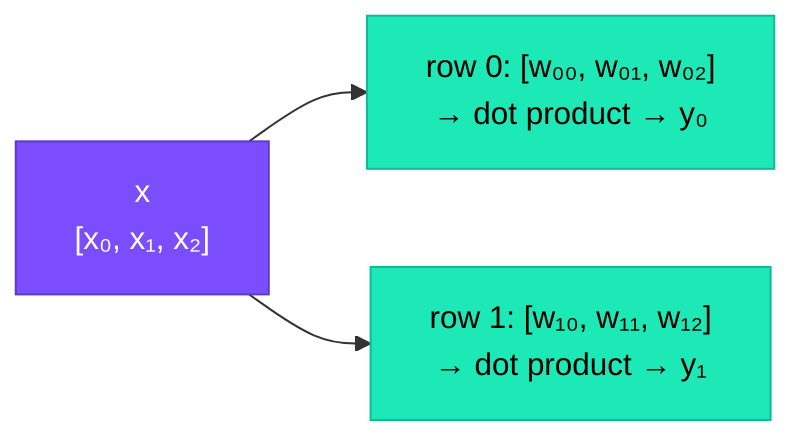

# Linear Layers

## The Problem

We have a 16-dimensional embedding vector `x`. Now we need to **transform** it — mix the information in its 16 dimensions to produce a new vector. This is the most fundamental computation in neural networks.

## What Is a Linear Layer?

A linear layer multiplies an input vector by a weight matrix. It's the neural network's way of "mixing and recombining" information.

### Concrete Example

A tiny 3→2 example (3 inputs, 2 outputs):

$$\mathbf{x} = [x_0, x_1, x_2], \quad W = \begin{bmatrix} w_{00} & w_{01} & w_{02} \\ w_{10} & w_{11} & w_{12} \end{bmatrix}$$

$$y_0 = w_{00} \cdot x_0 + w_{01} \cdot x_1 + w_{02} \cdot x_2$$

$$y_1 = w_{10} \cdot x_0 + w_{11} \cdot x_1 + w_{12} \cdot x_2$$

Each output element is a **weighted sum** of all input elements. The weights determine "how much of each input goes into each output."

!!! example "With numbers"

    $$\mathbf{x} = [2.0, 3.0, 1.0]$$

    $$W = \begin{bmatrix} 0.5 & -0.3 & 0.1 \\ 0.2 & 0.4 & -0.2 \end{bmatrix}$$

    $$y_0 = 0.5 \times 2 + (-0.3) \times 3 + 0.1 \times 1 = 1.0 - 0.9 + 0.1 = 0.2$$

    $$y_1 = 0.2 \times 2 + 0.4 \times 3 + (-0.2) \times 1 = 0.4 + 1.2 - 0.2 = 1.4$$

    $$\mathbf{y} = [0.2, 1.4]$$

## The Code (Lines 94–95)

```python title="microgpt.py — Lines 94-95"
def linear(x, w):
    return [sum(wi * xi for wi, xi in zip(wo, x)) for wo in w]
```

=== "Unpacked"

    ```python
    # For each row 'wo' in weight matrix 'w':
    for wo in w:
        # Compute the dot product of that row with input 'x':
        sum(wi * xi for wi, xi in zip(wo, x))
    ```

=== "Traced with numbers"

    ```text
    Row 0: wo = [0.5, -0.3, 0.1]
           sum(0.5×2, -0.3×3, 0.1×1) = 0.2

    Row 1: wo = [0.2, 0.4, -0.2]
           sum(0.2×2, 0.4×3, -0.2×1) = 1.4

    Result: [0.2, 1.4]
    ```

### What's a Dot Product?

The inner sum is called a **dot product**:

$$\text{dot}([a, b, c], [d, e, f]) = a \cdot d + b \cdot e + c \cdot f$$

It's a measure of "similarity" between two vectors. High dot product = vectors point in the same direction.

## Visual Representation



Each row of the weight matrix produces one output element. The number of rows determines the output size.

## Where Linear Layers Appear in microgpt.py

| Line | Usage | Transform |
|:----:|-------|:---------:|
| 118 | `linear(x, attn_wq)` | 16 → 16 (queries) |
| 119 | `linear(x, attn_wk)` | 16 → 16 (keys) |
| 120 | `linear(x, attn_wv)` | 16 → 16 (values) |
| 133 | `linear(x_attn, attn_wo)` | 16 → 16 (output projection) |
| 138 | `linear(x, mlp_fc1)` | 16 → 64 (expand) |
| 140 | `linear(x, mlp_fc2)` | 64 → 16 (compress) |
| 143 | `linear(x, lm_head)` | 16 → 27 (final prediction) |

The `linear` function is the workhorse — used **7 times** per layer, plus one more for the output.

## Why "Linear"?

Because $y = Wx$ is a **linear function** — if you double the input, you double the output. No curves, no bends. Just scaling and mixing.

!!! warning "Limitation"

    Linear layers can only represent straight-line relationships. To model complex patterns, we need **non-linearity** — that's what activation functions like ReLU provide.

!!! note "No Bias Terms"

    Standard neural networks often add a **bias**: $y = Wx + b$. Karpathy's implementation skips biases entirely — a simplification common in modern Transformer architectures.

??? note "Terminology"

    | Term | Meaning |
    |------|---------|
    | **Linear layer** | Multiplying input by a weight matrix; $y = Wx$ |
    | **Dot product** | Multiply elements pairwise, then sum |
    | **Weight matrix** | The grid of learnable parameters in a linear layer |
    | **Bias** | An optional additive vector (omitted in microgpt.py) |
    | **Projection** | Another word for "linear transformation" |
