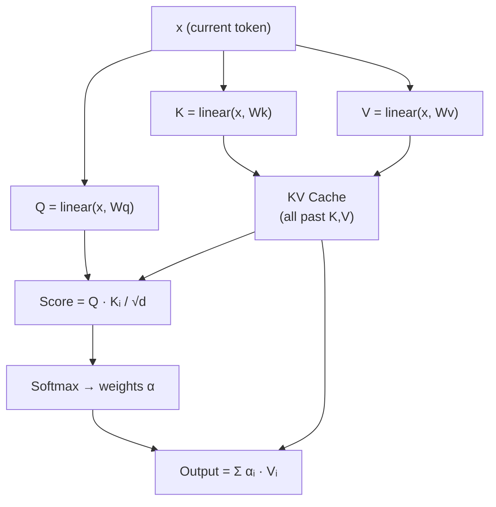

# Attention

## The Problem

The model has a 16-dimensional vector `x` for the current token. But language depends on **context**: the right next character depends on what came before. The letter after "qua" is likely "r" or "l" — but the model is processing one token at a time.

How does the current token **look back** at previous tokens to gather context?

## The Intuition: Library Lookup

!!! tip "The Analogy"

    Imagine you're in a library (you are the current token):

    - **Query (Q):** Your question — "What information do I need?"
    - **Key (K):** Each book's title — "Here's what I contain."
    - **Value (V):** Each book's contents — "Here's the actual information."

    You compare your query against each key to find relevant books, then read those books' values.

## The Code Setup (Lines 117–122)

```python title="microgpt.py — Lines 117-122"
x = rmsnorm(x)
q = linear(x, state_dict[f'layer{li}.attn_wq'])    # query: what am I looking for?
k = linear(x, state_dict[f'layer{li}.attn_wk'])    # key: what do I contain?
v = linear(x, state_dict[f'layer{li}.attn_wv'])    # value: what's my information?
keys[li].append(k)       # store key for future tokens to see
values[li].append(v)     # store value for future tokens to see
```

Each token produces:

- A **query** $\mathbf{q}$ (16-dim): "What information do I need?"
- A **key** $\mathbf{k}$ (16-dim): "Here's what I contain."
- A **value** $\mathbf{v}$ (16-dim): "Here's my actual information."

All three are produced by different linear transformations of the same input `x`.

## Scaled Dot-Product Attention (Lines 127–131)

```python title="microgpt.py — Lines 127-131 (inside the head loop)"
attn_logits = [sum(q_h[j] * k_h[t][j] for j in range(head_dim)) / head_dim**0.5
               for t in range(len(k_h))]
attn_weights = softmax(attn_logits)
head_out = [sum(attn_weights[t] * v_h[t][j] for t in range(len(v_h)))
            for j in range(head_dim)]
```

### Step 1: Compute Attention Scores

$$\text{score}(q, k_t) = \frac{\mathbf{q} \cdot \mathbf{k}_t}{\sqrt{d_k}}$$

The dot product measures **similarity** between the current query and each past key. Divide by $\sqrt{d_k}$ (the scaling factor) to keep values from getting too large.

### Step 2: Convert to Weights (Softmax)

$$\alpha_t = \text{softmax}(\text{scores})_t$$

!!! example "Numerical Example"

    For 3 past tokens with scores $[2.1, 0.3, -0.5]$:

    | Token | Score | Weight ($\alpha$) | Meaning |
    |:-----:|:-----:|:--------:|---------|
    | $t_0$ | 2.1 | 0.73 | "Very relevant" |
    | $t_1$ | 0.3 | 0.18 | "Somewhat relevant" |
    | $t_2$ | -0.5 | 0.09 | "Not very relevant" |

### Step 3: Weighted Sum of Values

$$\text{output} = \sum_t \alpha_t \cdot \mathbf{v}_t$$

Blend the value vectors, weighted by how relevant each past token is.

## The KV Cache

```python title="microgpt.py — Lines 121-122"
keys[li].append(k)
values[li].append(v)
```

!!! info "Why cache?"

    Each token's key and value are stored for **future tokens** to attend to. This way, when processing token 5, we have keys/values from tokens 0–4 already available. This avoids recomputing them — a critical optimization called the **KV cache**.

## Causal Masking (Built-In)

Notice we only attend to **past** tokens — the ones already in the `keys` list. The current token can't see the future because future keys haven't been appended yet. This is **causal masking** achieved by the sequential processing order, rather than an explicit mask matrix.

## Attention as a Flow



??? note "Terminology"

    | Term | Meaning |
    |------|---------|
    | **Attention** | A mechanism where a token looks at other tokens to gather information |
    | **Query (Q)** | "What am I looking for?" — generated from the current token |
    | **Key (K)** | "What do I contain?" — generated from each token |
    | **Value (V)** | "Here's my information" — what gets blended |
    | **Attention weight** | How much focus to put on each past token (sums to 1) |
    | **Scaled dot-product** | $\frac{Q \cdot K}{\sqrt{d_k}}$ — similarity score, scaled to prevent large values |
    | **KV cache** | Storing past keys/values so they're not recomputed |
    | **Causal masking** | Preventing tokens from seeing future tokens |
