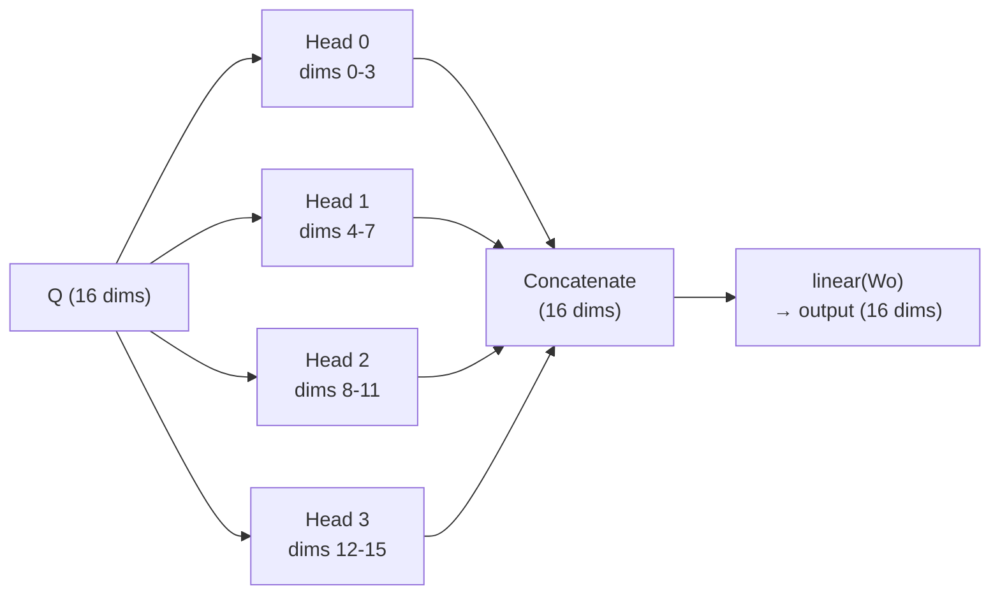

# Multi-Head Attention

## The Problem

A single attention mechanism computes one set of attention weights — one "perspective." But different aspects of language require **different types of attention**:

- One perspective might focus on **adjacent characters** (common pairs like "th", "er")
- Another might focus on the **first character** (names starting with certain letters tend to end certain ways)
- Another might focus on **repeated patterns** ("mm" → 'a' often follows)

One attention "head" can only learn one perspective. We need multiple.

## The Solution: Multiple Heads

Split the 16-dimensional Q, K, V vectors into **4 independent groups of 4 dimensions each**. Each group runs its own attention. Then concatenate the results.



Each head:

- Has its own 4-dimensional slice of Q, K, V
- Computes its own attention scores and weights
- Produces a 4-dimensional output

## The Code (Lines 123–132)

```python title="microgpt.py — Lines 123-132"
x_attn = []
for h in range(n_head):                    # n_head = 4
    hs = h * head_dim                       # head start index: 0, 4, 8, 12
    q_h = q[hs:hs+head_dim]                # slice of Q for this head
    k_h = [ki[hs:hs+head_dim] for ki in keys[li]]   # slice of each K
    v_h = [vi[hs:hs+head_dim] for vi in values[li]]  # slice of each V

    # Scaled dot-product attention (per head)
    attn_logits = [sum(q_h[j] * k_h[t][j] for j in range(head_dim)) / head_dim**0.5
                   for t in range(len(k_h))]
    attn_weights = softmax(attn_logits)
    head_out = [sum(attn_weights[t] * v_h[t][j] for t in range(len(v_h)))
                for j in range(head_dim)]
    x_attn.extend(head_out)                 # concatenate head outputs
```

=== "Head 0 walkthrough"

    ```text
    hs = 0 × 4 = 0

    q_h = q[0:4]                → first 4 dimensions of q
    k_h = [k₀[0:4], k₁[0:4], ...] → first 4 dims of each past key
    v_h = [v₀[0:4], v₁[0:4], ...] → first 4 dims of each past value

    → attention on dimensions 0–3
    → produces 4-dimensional output
    → x_attn.extend(head_out) appends these 4 values
    ```

=== "All 4 heads combined"

    ```text
    x_attn = [head0_out(4), head1_out(4), head2_out(4), head3_out(4)]
           = 16 dimensions total
    ```

## Output Projection (Line 133)

```python title="microgpt.py — Line 133"
x = linear(x_attn, state_dict[f'layer{li}.attn_wo'])
```

After concatenating the 4 heads, one more linear layer **mixes** them together. This lets the model combine information from different attention perspectives.

## Why Split Instead of 4 Full-Size Heads?

| Approach | Operations per step |
|----------|:-------------------:|
| 4 full-size heads (16 dims each) | $4 \times (16 \times 16) = 1024$ |
| 4 split heads (4 dims each) | $4 \times (4 \times 4) = 64$ |

!!! tip

    Same number of total parameters (the Q, K, V matrices are still 16×16), but the attention computations are **16× cheaper**. And empirically, multiple small heads learn *better* than one big head.

??? note "Terminology"

    | Term | Meaning |
    |------|---------|
    | **Multi-head attention** | Running multiple attention heads in parallel on subsets of dimensions |
    | **Head** | One independent attention mechanism |
    | **head_dim** | The dimension of each head ($n_\text{embd} / n_\text{head}$) |
    | **Concatenation** | Joining head outputs end-to-end |
    | **Output projection** | A linear layer that mixes the concatenated heads |
