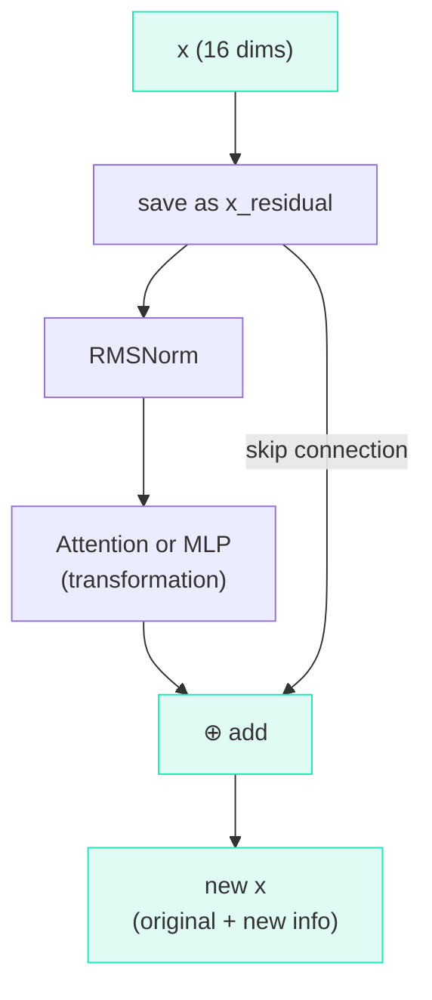

# Residual Connections

## The Problem

The attention block transforms `x` into something new. But what if the transformation *loses* important information that was in the original `x`?

!!! info "Analogy"

    Imagine editing a document: you highlight a paragraph and **replace** it entirely. If the replacement is bad, the original is lost. But if you *add a comment* next to the original, you keep both.

## The Solution: Add, Don't Replace

A **residual connection** (or "skip connection") is embarrassingly simple:

$$\text{output} = \text{input} + f(\text{input})$$

Instead of replacing the input, we **add** the transformation on top. If the transformation learns nothing useful, it can output zeros, and the input passes through unchanged.

## The Code (Lines 116, 134, 136, 141)

```python title="microgpt.py — Attention block"
x_residual = x                                    # save original
# ... attention computation (lines 117-133) ...
x = [a + b for a, b in zip(x, x_residual)]        # add original back
```

```python title="microgpt.py — MLP block"
x_residual = x                                    # save original
# ... MLP computation (lines 137-140) ...
x = [a + b for a, b in zip(x, x_residual)]        # add original back
```

Each element: $\text{output}_i = \text{transformed}_i + \text{original}_i$.

## Why This Works

=== "1. Gradient Highway"

    During the backward pass, gradients must flow from the loss back to early parameters. Without residuals, the gradient passes through every operation and can shrink to near-zero (**vanishing gradients**).

    The addition creates a **shortcut**:

    $$\frac{d(a + b)}{da} = 1 \quad \text{← gradient flows straight through!}$$

    Since the derivative of addition is 1, the gradient passes through *unchanged*.

=== "2. Starting from Identity"

    Remember that `attn_wo` and `mlp_fc2` are initialized to **zero**:

    - Attention/MLP blocks initially output zeros
    - $x = \text{zeros} + x = x$
    - **The model starts as the identity function**

    It then *gradually* learns to add useful transformations on top.

=== "3. Preserving Information"

    The original information is never lost. Each block can only **add** new information. If a block learns nothing useful, it outputs zeros, and the input passes through unchanged.

## Visual



??? note "Terminology"

    | Term | Meaning |
    |------|---------|
    | **Residual connection** | Adding the input to the output: $y = x + f(x)$ |
    | **Skip connection** | Same thing — the input "skips over" the transformation |
    | **Vanishing gradients** | Gradients shrinking to near-zero in deep networks |
    | **Identity function** | $f(x) = x$ — what residuals default to |
