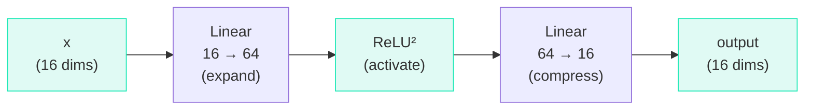

# The MLP Block

## The Problem

Attention lets tokens **communicate** — each token can gather information from other tokens. But attention is a **linear** operation (weighted sums). It can only compute linear combinations of existing information.

To learn complex patterns (like "after 'qu', the next letter is usually a vowel"), the model needs **non-linear processing**.

## The MLP (Multi-Layer Perceptron)

The MLP is a two-layer network sandwiched around a non-linear activation:



## The Code (Lines 135–141)

```python title="microgpt.py — Lines 135-141"
# 2) MLP block
x_residual = x                                      # save for residual
x = rmsnorm(x)                                      # normalize
x = linear(x, state_dict[f'layer{li}.mlp_fc1'])     # expand: 16 → 64
x = [xi.relu() ** 2 for xi in x]                    # activation: ReLU²
x = linear(x, state_dict[f'layer{li}.mlp_fc2'])     # compress: 64 → 16
x = [a + b for a, b in zip(x, x_residual)]          # residual connection
```

=== "Line 138: Expand (16 → 64)"

    ```python
    x = linear(x, state_dict[f'layer{li}.mlp_fc1'])   # mlp_fc1 is 64 × 16
    ```

    The first linear layer produces 64 outputs. This **4× expansion** gives the model more room to compute complex features.

=== "Line 139: Activation (ReLU²)"

    ```python
    x = [xi.relu() ** 2 for xi in x]
    ```

    Applies $\text{ReLU}(x)^2 = (\max(0, x))^2$:

    $$\text{ReLU}^2(x) = \begin{cases} x^2 & \text{if } x > 0 \\ 0 & \text{if } x \leq 0 \end{cases}$$

    Why not just a linear function? Because two linear layers in sequence are equivalent to a single linear layer. The non-linearity is what lets the MLP compute complex functions.

=== "Line 140: Compress (64 → 16)"

    ```python
    x = linear(x, state_dict[f'layer{li}.mlp_fc2'])   # mlp_fc2 is 16 × 64
    ```

    Project back down from 64 to 16 dimensions. The model "decides" what's worth keeping in just 16 numbers.

## What Does the MLP Actually Do?

!!! info "MLP as a Memory Bank"

    Researchers have found that MLP layers in Transformers act as **memory banks**:

    - The first layer's weights (64×16) contain **keys** — patterns to match against
    - The activation function acts as a **gate** — turning off irrelevant patterns
    - The second layer's weights (16×64) contain **values** — information to inject when a pattern matches

    ```text
    "If input looks like [pattern A]" → inject [knowledge A]
    "If input looks like [pattern B]" → inject [knowledge B]
    ```

??? note "Terminology"

    | Term | Meaning |
    |------|---------|
    | **MLP** | Multi-Layer Perceptron — a two-layer feedforward network |
    | **Activation function** | A non-linear function between layers (here: ReLU²) |
    | **Expansion ratio** | Factor by which the hidden dimension expands (4× here) |
    | **Feedforward** | Information flows in one direction (no loops) |
    | **Non-linearity** | Any function that isn't $f(x) = ax + b$ |
