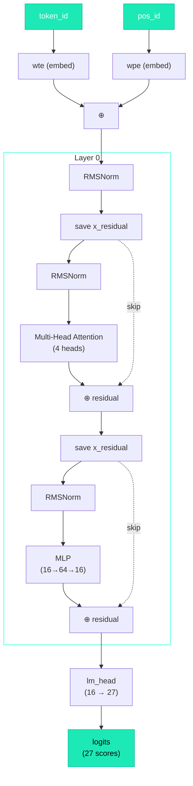

# The Full GPT Function

## Putting It All Together

We've studied every component. Now let's see the complete `gpt()` function — all of them assembled into a single pipeline that takes a token and produces predictions.

## The Code (Lines 108–144)

```python title="microgpt.py — Lines 108-144"
def gpt(token_id, pos_id, keys, values):
    # Step 1: Embed
    tok_emb = state_dict['wte'][token_id]       # token embedding lookup
    pos_emb = state_dict['wpe'][pos_id]          # position embedding lookup
    x = [t + p for t, p in zip(tok_emb, pos_emb)] # combine: what + where
    x = rmsnorm(x)                                # normalize

    for li in range(n_layer):                     # for each layer (just 1)
        # 1) Multi-head attention block
        x_residual = x
        x = rmsnorm(x)
        q = linear(x, state_dict[f'layer{li}.attn_wq'])
        k = linear(x, state_dict[f'layer{li}.attn_wk'])
        v = linear(x, state_dict[f'layer{li}.attn_wv'])
        keys[li].append(k)
        values[li].append(v)
        x_attn = []
        for h in range(n_head):
            hs = h * head_dim
            q_h = q[hs:hs+head_dim]
            k_h = [ki[hs:hs+head_dim] for ki in keys[li]]
            v_h = [vi[hs:hs+head_dim] for vi in values[li]]
            attn_logits = [sum(q_h[j] * k_h[t][j] for j in range(head_dim)) / head_dim**0.5
                           for t in range(len(k_h))]
            attn_weights = softmax(attn_logits)
            head_out = [sum(attn_weights[t] * v_h[t][j] for t in range(len(v_h)))
                        for j in range(head_dim)]
            x_attn.extend(head_out)
        x = linear(x_attn, state_dict[f'layer{li}.attn_wo'])
        x = [a + b for a, b in zip(x, x_residual)]         # residual

        # 2) MLP block
        x_residual = x
        x = rmsnorm(x)
        x = linear(x, state_dict[f'layer{li}.mlp_fc1'])    # expand 16→64
        x = [xi.relu() ** 2 for xi in x]                    # activate
        x = linear(x, state_dict[f'layer{li}.mlp_fc2'])    # compress 64→16
        x = [a + b for a, b in zip(x, x_residual)]         # residual

    logits = linear(x, state_dict['lm_head'])               # project to vocab
    return logits
```

## The Data Flow

=== "Step 1: Embedding"

    ```text
    Input: token_id = 4 ('e'), pos_id = 0
    tok_emb = wte[4]        → 16 numbers representing 'e'
    pos_emb = wpe[0]        → 16 numbers representing "first position"
    x = tok_emb + pos_emb   → 16 numbers: "'e' at position 0"
    x = rmsnorm(x)          → 16 numbers, normalized
    ```

=== "Step 2: Attention Block"

    ```text
    x_residual = x                                      (save)
    x = rmsnorm(x)                                      (normalize)
    q, k, v = linear(x, Wq), linear(x, Wk), linear(x, Wv)
    For each of 4 heads:
      Compute attention weights over all past tokens
      Weighted sum of values → 4 numbers
    Concatenate → 16 numbers
    x = linear(concat, Wo) → 16 numbers
    x = x + x_residual                                  (residual)
    ```

=== "Step 3: MLP Block"

    ```text
    x_residual = x                                      (save)
    x = rmsnorm(x)                                      (normalize)
    x = linear(x, fc1)      → 64 numbers (expanded)
    x = ReLU(x)²            → 64 numbers (activated)
    x = linear(x, fc2)      → 16 numbers (compressed)
    x = x + x_residual                                  (residual)
    ```

=== "Step 4: Output"

    ```text
    logits = linear(x, lm_head) → 27 numbers (one per character)
    ```

## The Architecture Diagram



## What the Logits Mean

The output is 27 numbers — one for each token in the vocabulary:

```text
logits[0]  → raw score for 'a'
logits[1]  → raw score for 'b'
...
logits[25] → raw score for 'z'
logits[26] → raw score for <BOS>
```

!!! warning

    These are **not probabilities yet.** They're raw scores that can be negative or very large. To get probabilities, we apply softmax outside this function.

## Why "GPT"?

**GPT** = **G**enerative **P**re-trained **T**ransformer

- **Generative:** It generates text (one token at a time)
- **Pre-trained:** It's trained on data before being used
- **Transformer:** The architecture — attention + MLP + residual connections

!!! tip

    This function **IS** the Transformer. The rest is training and inference.

## Scaling Up

| | microgpt.py | GPT-2 Small | GPT-3 |
|---|:-----------:|:-----------:|:-----:|
| `n_embd` | 16 | 768 | 12,288 |
| `n_head` | 4 | 12 | 96 |
| `n_layer` | 1 | 12 | 96 |
| `block_size` | 8 | 1,024 | 2,048 |
| Parameters | 4,064 | 124M | 175B |

Same architecture. Same code. Just bigger matrices.

!!! success "Checkpoint ✓"

    You now understand the **entire model architecture**:

    - :white_check_mark: Parameters — random numbers that encode knowledge
    - :white_check_mark: Embeddings — representing tokens and positions as vectors
    - :white_check_mark: Linear layers — mixing information via matrix multiplication
    - :white_check_mark: Softmax — converting scores to probabilities
    - :white_check_mark: RMSNorm — keeping values well-behaved
    - :white_check_mark: Attention — deciding which tokens to focus on
    - :white_check_mark: Multi-head — multiple attention perspectives
    - :white_check_mark: Residual connections — preserving original information
    - :white_check_mark: MLP — non-linear processing and knowledge storage
    - :white_check_mark: Full GPT — all pieces assembled
