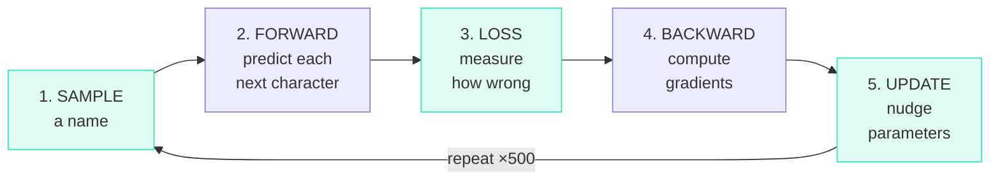

# What Is Training?

## The Big Idea

You have a model (`gpt()`) that takes a token and produces predictions. But right now its 4,064 parameters are **random** — its predictions are garbage.

**Training** is the process of showing the model thousands of examples and adjusting its parameters so it gets better at predicting.

## Before vs. After Training

=== "Before Training (random)"

    ```text
    Input: 'e' at position 0
    Output probabilities (27 characters):

    'a': 3.7%   'b': 3.8%   'c': 3.5%   'd': 3.9%   'e': 3.6%
    'f': 3.4%   'g': 4.0%   'h': 3.3%   'i': 4.1%   'j': 3.2%
    ...
    ```

    Nearly uniform — every character has ~3.7%. The model is guessing randomly.

=== "After Training (500 steps)"

    ```text
    Input: 'e' at position 0
    Output probabilities:

    'l': 15.2%   'm': 12.8%   'r': 10.1%   'v': 9.3%   's': 8.7%
    'd': 7.2%    'a': 5.1%    'i': 4.8%    ...
    ```

    The model learned: after 'e' in names, letters like 'l', 'm', 'r' are most common (elena, emma, erin...).

## The Training Recipe

Each training step follows this exact recipe:



## The Training Loop (Lines 153–184, Overview)

```python title="microgpt.py — Lines 152-184 (simplified)"
num_steps = 500
for step in range(num_steps):
    # 1. Sample a document
    doc = docs[step % len(docs)]
    tokens = [BOS] + [uchars.index(ch) for ch in doc] + [BOS]
    n = min(block_size, len(tokens) - 1)

    # 2. Forward pass + 3. Loss computation
    keys, values = [[] for _ in range(n_layer)], [[] for _ in range(n_layer)]
    losses = []
    for pos_id in range(n):
        token_id, target_id = tokens[pos_id], tokens[pos_id + 1]
        logits = gpt(token_id, pos_id, keys, values)
        probs = softmax(logits)
        loss_t = -probs[target_id].log()
        losses.append(loss_t)
    loss = (1 / n) * sum(losses)

    # 4. Backward pass
    loss.backward()

    # 5. Update parameters (Adam optimizer)
    # ... (covered in a later lesson)
```

!!! info "The flow for a name like \"emma\""

    1. Wrap it: `[BOS, 'e', 'm', 'm', 'a', BOS]`
    2. For each position, predict the next character
    3. Compute a loss (how wrong were the predictions overall)
    4. Call `backward()` to compute all gradients
    5. Update each parameter in the direction that reduces the loss

## How the Loss Evolves

```text
step    1 / 500 | loss 3.8912    ← random predictions, high loss
step   50 / 500 | loss 2.8401    ← starting to learn common letters
step  100 / 500 | loss 2.4102    ← learning letter pairs
step  200 / 500 | loss 2.0312    ← learning name-like patterns
step  300 / 500 | loss 1.8543    ← getting good
step  500 / 500 | loss 1.5012    ← reasonably trained
```

The loss decreasing means the model is getting **better at predicting** the next character.

!!! tip "Why only 500 steps?"

    This is a tiny model on a simple dataset. 500 steps is enough for reasonable results. Larger models on larger datasets train for millions of steps.

??? note "Terminology"

    | Term | Meaning |
    |------|---------|
    | **Training** | Iteratively adjusting parameters to minimize loss |
    | **Training step** | One iteration of forward → loss → backward → update |
    | **Epoch** | One pass through the entire dataset |
    | **num_steps** | How many training steps to run |
    | **Training loop** | The for-loop that runs all the training steps |
