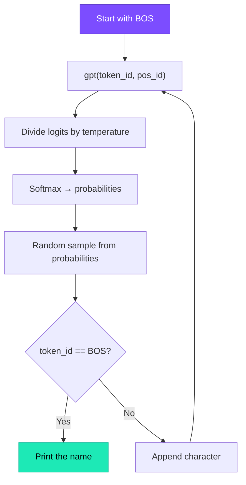

# Generating Text

## From Training to Generation

The model is trained. Its 4,064 parameters have been tuned over 500 steps. Now we use it to **create** — generating names it has never seen.

## The Generation Loop (Lines 186–200)

```python title="microgpt.py — Lines 186-200"
temperature = 0.5

for _ in range(20):                 # generate 20 names
    tokens = []
    token_id = BOS                   # start with BOS
    keys = [[] for _ in range(n_layer)]
    values = [[] for _ in range(n_layer)]

    for pos_id in range(block_size): # max 8 characters
        logits = gpt(token_id, pos_id, keys, values)
        probs = softmax([l / temperature for l in logits])
        token_id = random.choices(range(vocab_size), weights=[p.data for p in probs])[0]
        if token_id == BOS:
            break                    # BOS signals end-of-name
        tokens.append(token_id)
    
    print(''.join(uchars[t] for t in tokens))
```

## Step by Step



=== "Step 0"

    ```text
    Input: BOS (26), position 0
    Model predicts: 'e' has highest probability
    Sampled: 'e'
    tokens = ['e']
    ```

=== "Step 1"

    ```text
    Input: 'e' (4), position 1
    Model predicts (using KV cache from step 0): 'm' likely
    Sampled: 'm'
    tokens = ['e', 'm']
    ```

=== "Step 2"

    ```text
    Input: 'm' (12), position 2
    Model predicts (KV cache has steps 0-1): 'm' or 'a' likely
    Sampled: 'i'
    tokens = ['e', 'm', 'i']
    ```

=== "Step 3"

    ```text
    Input: 'i' (8), position 3
    Model predicts: 'l' likely
    Sampled: 'l'
    tokens = ['e', 'm', 'i', 'l']
    ```

=== "Step 4"

    ```text
    Input: 'l' (11), position 4
    Model predicts: 'y' or BOS likely
    Sampled: 'y'
    tokens = ['e', 'm', 'i', 'l', 'y']
    ```

=== "Step 5"

    ```text
    Input: 'y' (24), position 5
    Model predicts: BOS has highest probability
    Sampled: BOS → STOP
    Output: "emily"  (a completely new name!)
    ```

## Key Details

### Autoregressive Generation

Each output token becomes the **input** for the next step. The model generates one character at a time, building the name left-to-right.

!!! info "The KV cache in action"

    At each step, the current token's key and value are appended to the cache. So at step 4, the model can attend to all of steps 0–3. No recomputation needed.

### Stopping Condition

```python
if token_id == BOS:
    break
```

The BOS token serves double duty — it marks both the start and end of sequences. When the model predicts BOS, it's saying "this name is done."

### No Gradient Tracking

During inference, we don't call `backward()`. We're using the trained parameters as-is — just doing forward passes. This makes generation much faster than training.

??? note "Terminology"

    | Term | Meaning |
    |------|---------|
    | **Inference** | Using the trained model to generate predictions (no learning) |
    | **Autoregressive** | Each output becomes the next input |
    | **Sampling** | Randomly choosing a token based on probabilities |
    | **Stopping condition** | When to end generation (BOS token) |
    | **KV cache** | Stored keys/values for efficient multi-step generation |
