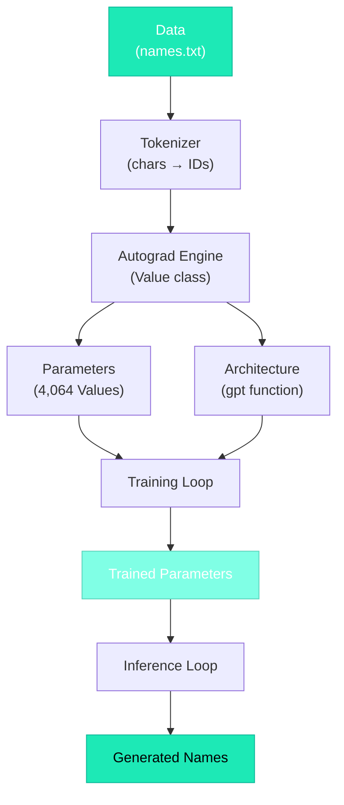

# The Complete Picture

## You've Made It

If you've read through every lesson in order, you now understand **every single line** of `microgpt.py`. Let's zoom out and see the whole thing as one coherent story.

## The Story of 200 Lines

=== "Act 1: The World (Lines 1–27)"

    > *"Let there be data."*

    We start with a text file of 32,000 human names. Each name is a sequence of characters. We build a tokenizer: 26 letters + 1 BOS token = 27 tokens total.

    **What we built:** A dataset and a way to encode/decode text.

=== "Act 2: The Engine (Lines 29–72)"

    > *"Let there be learning."*

    We build a tiny automatic differentiation engine — the `Value` class. Every number remembers how it was computed. When we call `backward()`, it walks the computation graph in reverse, computing derivatives using the chain rule.

    **What we built:** An autograd engine that makes training possible.

=== "Act 3: The Mind (Lines 74–144)"

    > *"Let there be intelligence."*

    We initialize ~4,000 random parameters and define the architecture:

    **Embed → Normalize → Attend → Think → Predict**

    - **Embeddings** give each token a rich representation
    - **Attention** lets tokens look at their context
    - **MLP** does non-linear processing
    - **Residual connections** preserve information
    - **RMSNorm** keeps values stable

    **What we built:** A Transformer that maps tokens to predictions.

=== "Act 4: The Training (Lines 146–184)"

    > *"Let there be knowledge."*

    The model starts knowing nothing. Over 500 steps, we show it names, measure prediction error (cross-entropy), compute gradients (backpropagation), and adjust parameters (Adam with cosine decay).

    The loss drops from ~3.3 (random chance) to ~1.5 (reasonably good).

    **What we built:** A training loop that instills knowledge into parameters.

=== "Act 5: The Voice (Lines 186–200)"

    > *"Let there be creation."*

    We generate 20 new names: start with BOS, predict characters one at a time, sample with temperature=0.5, stop when BOS reappears.

    **What we built:** An inference loop that generates new text.

## The Complete Dependency Map

## microgpt.py vs. ChatGPT

| microgpt.py | ChatGPT | Same algorithm? |
|-------------|---------|:---:|
| Character-level tokenizer | BPE tokenizer (50k+ tokens) | :white_check_mark: |
| `Value` class (Python) | PyTorch autograd (CUDA) | :white_check_mark: |
| 4,064 params | 175B+ params | :white_check_mark: |
| 1 layer, 4 heads | 96 layers, 96 heads | :white_check_mark: |
| 500 training steps | Millions of steps | :white_check_mark: |
| 1 CPU | Thousands of GPUs | :white_check_mark: |
| names.txt | Terabytes of internet text | :white_check_mark: |

!!! tip "Everything else is just efficiency"

    The *algorithm* is identical. The differences are **scale** (more parameters, data, compute), **speed** (GPU acceleration), and **polish** (better tokenizers, fine-tuning, RLHF). But the fundamental loop — embed, attend, predict, compute loss, backpropagate, update — is the same.

## Concepts You Now Understand

| Concept | What you know |
|---------|--------------|
| **Tokenization** | Converting text to numbers and back |
| **Embeddings** | Representing tokens as learnable vectors |
| **Attention** | $Q \cdot K / \sqrt{d_k}$ to compute relevance, weighted sum of $V$ |
| **Multi-head attention** | Multiple parallel attention perspectives |
| **Residual connections** | Skip connections that preserve information |
| **RMSNorm** | Keeping values well-scaled |
| **MLP** | Non-linear processing (expand → activate → compress) |
| **Forward pass** | Computing predictions and building the graph |
| **Backward pass** | Computing gradients via chain rule |
| **Cross-entropy loss** | $-\log(P(\text{correct}))$ |
| **Adam optimizer** | Momentum + adaptive learning rates |
| **Temperature** | Controlling generation randomness |
| **Autoregressive generation** | Each output becomes the next input |

## Where to Go From Here

!!! example "Experiments to try"

    - Change `n_embd` (16 → 32) and see the effect
    - Change `temperature` (0.5 → 0.1, 1.0, 2.0)
    - Train for more steps (500 → 2000)
    - Use a different dataset (cities, words, anything)

!!! info "Further reading"

    - [Karpathy's "Let's build GPT"](https://www.youtube.com/watch?v=kCc8FmEb1nY) — video version of this journey
    - [The original Transformer paper: "Attention Is All You Need"](https://arxiv.org/abs/1706.03762)
    - [GPT-2 paper](https://cdn.openai.com/better-language-models/language_models_are_unsupervised_multitask_learners.pdf)

## The Final Analogy

It's like learning that a car engine has just four strokes: intake, compress, ignite, exhaust. Everything else — turbochargers, fuel injection, cooling systems — is optimization. But the four strokes ARE the engine.

In our case:

- **Embed** (intake)
- **Attend + Transform** (compress + ignite)
- **Predict → Loss → Gradient → Update** (exhaust + repeat)

That's the engine. You now understand every moving part.
