---
hide:
  - navigation
  - toc
---

# MicroGPT: A First-Principles Course

Reverse-engineer <strong>every single line</strong> of a 200-line GPT language model. 
From 10th-grade math to building your first LLM. No magic, no hand-waving.

[Start Learning :material-arrow-right:](00-the-big-picture/00-what-is-a-language-model.md){ .md-button .md-button--primary }
[View the Code :material-github:](https://github.com/iamkhalid2/microgpt-course){ .md-button }

---

## What You'll Build a Mental Model For

```mermaid
flowchart LR
    A["📝 Raw Text"] --> B["🔢 Tokenization"]
    B --> C["📐 Embeddings"]
    C --> D["🧠 Transformer"]
    D --> E["📊 Probabilities"]
    E --> F["✨ Generated Text"]

    style A fill:#1de9b6,stroke:#1de9b6,color:#fff
    style B fill:#17c9a0,stroke:#17c9a0,color:#fff
    style C fill:#12a889,stroke:#12a889,color:#fff
    style D fill:#0d8872,stroke:#0d8872,color:#fff
    style E fill:#096b5b,stroke:#096b5b,color:#fff
    style F fill:#1de9b6,stroke:#1de9b6,color:#000
```

---

## Course Modules

### :material-map-outline: Module 0 — The Big Picture

What is a language model? A bird's-eye view of the 200 lines and the mental model for how learning machines work.

### :material-database-outline: Module 1 — Data & Tokenization

How raw text becomes numbers. Character encoding, vocabularies, and the special BOS token.

### :material-math-integral: Module 2 — Calculus & Autograd

Derivatives, the chain rule, and how `microgpt.py` automatically computes gradients with the `Value` class.

### :material-brain: Module 3 — The Architecture

Embeddings, linear layers, softmax, attention, multi-head attention, residual connections, and the full GPT function.

### :material-dumbbell: Module 4 — Training

Loss functions, backpropagation, gradient descent, the Adam optimizer, and the complete training loop.

### :material-creation-outline: Module 5 — Inference & Generation

Using the trained model to generate new text. Temperature, sampling, and the complete picture.

---

## Prerequisites

!!! tip "What you need to know"

    - **Math**: 10th-grade level — basic algebra and exponents. There's a [Math Refresher](appendix/math-refresher.md) if you need it.
    - **Programming**: Basic Python — variables, loops, functions, lists.
    - **Machine Learning**: Zero prior knowledge required.

## Based On

This course is built around [`microgpt.py`](https://github.com/karpathy/microgpt) by **Andrej Karpathy** — a complete GPT language model in just **200 lines** of pure Python using only the standard library.

It implements:

- [x] A custom autograd engine (automatic differentiation)
- [x] A Transformer architecture (attention, MLP, residual connections)
- [x] A training loop with the Adam optimizer
- [x] Text generation with temperature-controlled sampling
